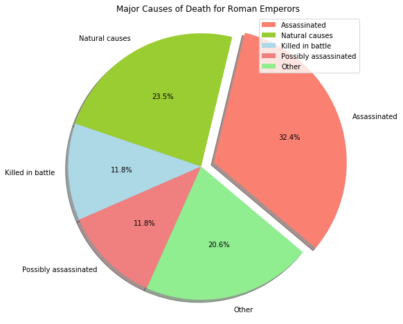
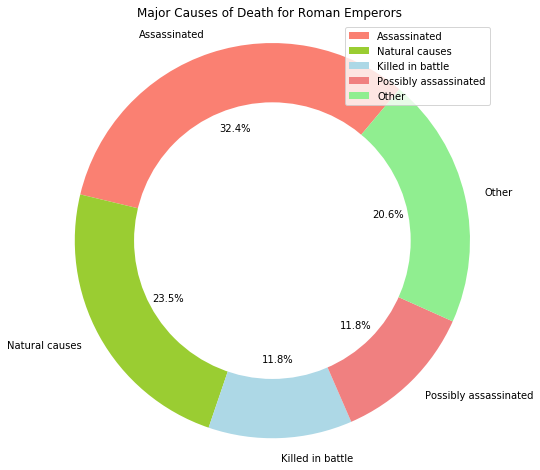

# Data Visualization: Compositions with Pie/Donut charts

## Exercise 1:

Create a pie chart showing the major causes of death of all Roman Emperors.

* Read the data from `roman-emperor-regins.csv`. 
* Count the values for each class in `Cause_of_Death`.
* Create subsets from complete dataset containing only those emperors with causes of death -  assasinated, possibly assassinated, natural death, killed in battle, and combine the rest as 'others'.
* Set colors and labels for chosen classes.
* Explode the slice with highest magnitude, also set the shadows to true.
* Show the percentages in each slice


```python
# Load the libraries, dataset and explore the head


# Emperor	Length_of_Reign	Cause_of_Death
# 0	Augustus	40.58	Possibly assassinated
# 1	Tiberius	22.50	Possibly assassinated
# 2	Caligula	4.83	Assassinated
# 3	Claudius	13.75	Possibly assassinated
# 4	Nero	13.67	Suicide
```


```python
# Count the values for each cuase of death


# Assassinated             22
# Natural causes           16
# Killed in battle          8
# Possibly assassinated     8
# Suicide                   5
# Illness                   5
# Executed                  3
# Died in captivity         1
# Name: Cause_of_Death, dtype: int64
```


```python
# Create dataframes for each chosen causes of deaths, count the frequency of each cause and count the rest as 'other'

emp_a = None # Assassinated
emp_nc = None # Natural causes
emp_kb = None # Killed in battle
emp_pa = None # Possibly assassinated

# Calculate the frequency of other causes
other = None

# Create a values array from lengths of all chosen causes + other
vals = None

# Create a Label array for the pie chart
labels = None
```

Above can also be achieved in a simpler way using pandas built in functions.


```python
# Colors for each slice in the pie chart and set explode for Assassinated = 0.1
colors = None
explode = None
```


```python
# Create a new figure space with a single axes

# Create the pie chart with above data and customize by passing extra arguments

# Label the pie chart and show the legend
```


```python

```





# Exercise 2

Convert the the pie chart above into a donut chart using same labels and colours. Show percentages at suitable location and set legend. Rotate the plot for a clear output.  


```python
# Create a new figure space with a single axes

# Draw a pie chart as seen earlier

# Draw a white colored circle at origin (0,0) with a suitable radius

# Get a reference to the current figure and add circle to current axes

# Equal aspect ratio ensures that pie is drawn as a circle

# Label and show the chart
```


```python

```




